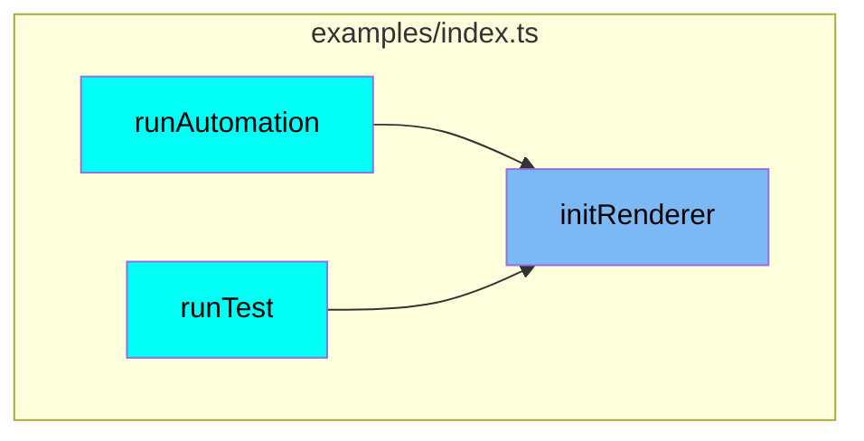
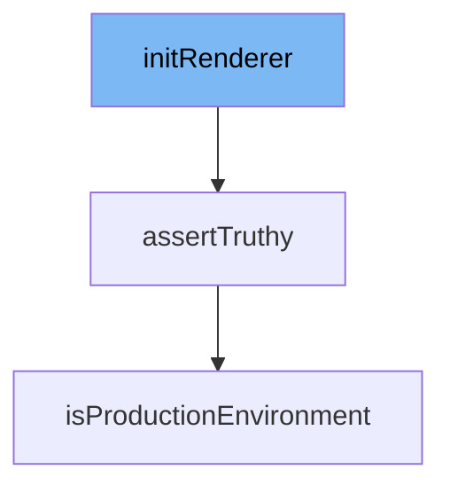

This document will cover the process of initializing the renderer, which includes:

1. The function `initRenderer` from `examples/index.ts`
2. The function `assertTruthy` from `src/utils.ts`
3. The function `isProductionEnvironment` from `src/utils.ts`.

## Where is this flow used?

The flow starts with the function `initRenderer`. It is called from multiple entry points as represented in the following diagram:



## The flow itself



<SwmSnippet path="/examples/index.ts" line="1">

---

# initRenderer Function

The `initRenderer` function is the entry point for initializing the renderer. It's the first function called in the process.

```typescript
/*
 * If not stated otherwise in this file or this component's LICENSE file the
 * following copyright and licenses apply:
 *
 * Copyright 2023 Comcast Cable Communications Management, LLC.
```

---

</SwmSnippet>

<SwmSnippet path="/src/utils.ts" line="78">

---

# assertTruthy Function

The `assertTruthy` function is called by `initRenderer`. It's used to ensure certain conditions, arguments and properties are set/met before continuing. If the condition is not met, it throws an error.

```typescript
export function assertTruthy(
  condition: unknown,
  message?: string,
): asserts condition {
  if (isProductionEnvironment()) return;
  if (!condition) {
    throw new Error(message || 'Assertion failed');
  }
}
```

---

</SwmSnippet>

<SwmSnippet path="/src/utils.ts" line="237">

---

# isProductionEnvironment Function

The `isProductionEnvironment` function is called by `assertTruthy`. It checks if the environment is production. If it is, it returns and does not throw an error even if the condition is not met.

```typescript
export function isProductionEnvironment(): boolean {
  return import.meta.env && import.meta.env.PROD;
}
```

---

</SwmSnippet>

&nbsp;

*This is an auto-generated document by Swimm AI 🌊 and has not yet been verified by a human*

<SwmMeta version="3.0.0" repo-id="Z2l0aHViJTNBJTNBcmVuZGVyZXIlM0ElM0FTd2ltbS1EZW1v" repo-name="renderer" doc-type="flows"><sup>Powered by [Swimm](/)</sup></SwmMeta>
