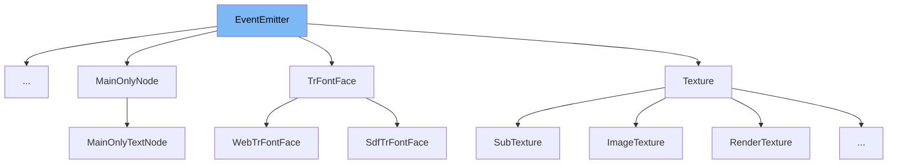

This document will cover the EventEmitter class. We'll cover:

1. What is EventEmitter
2. Variables and functions in EventEmitter
3. Usage example of EventEmitter



# What is EventEmitter

The EventEmitter class is a base class that provides a mechanism to handle events. It is used to register listeners for an event, trigger an event, and unregister listeners. It is a crucial part of the event-driven architecture of the application.

<SwmSnippet path="/src/common/EventEmitter.ts" line="30">

---

# Variables and functions

The `eventListeners` variable is an object that stores all the listeners for different events. The keys of the object are the event names and the values are arrays of listeners.

```typescript
  private eventListeners: { [eventName: string]: any } = {};
```

---

</SwmSnippet>

<SwmSnippet path="/src/common/EventEmitter.ts" line="32">

---

The `on` function is used to register a listener for an event. It takes the event name and the listener function as arguments. If there are no existing listeners for the event, it creates a new array and adds the listener to it.

```typescript
  on(event: string, listener: (target: any, data: any) => void): void {
    let listeners = this.eventListeners[event];
    if (!listeners) {
      listeners = [];
    }
    listeners.push(listener);
    this.eventListeners[event] = listeners;
  }
```

---

</SwmSnippet>

<SwmSnippet path="/src/common/EventEmitter.ts" line="41">

---

The `off` function is used to remove a listener from an event. If no listener is provided, it removes all listeners for the event. If a listener is provided, it removes only that specific listener.

```typescript
  off(event: string, listener?: (target: any, data: any) => void): void {
    const listeners = this.eventListeners[event];
    if (!listeners) {
      return;
    }
    if (!listener) {
      delete this.eventListeners[event];
      return;
    }
    const index = listeners.indexOf(listener);
    if (index >= 0) {
      listeners.splice(index, 1);
    }
  }
```

---

</SwmSnippet>

<SwmSnippet path="/src/common/EventEmitter.ts" line="56">

---

The `once` function is similar to the `on` function but the listener is automatically removed after it is called once.

```typescript
  once(event: string, listener: (target: any, data: any) => void): void {
    const onceListener = (target: any, data: any) => {
      this.off(event, onceListener);
      listener(target, data);
    };
    this.on(event, onceListener);
  }
```

---

</SwmSnippet>

<SwmSnippet path="/src/common/EventEmitter.ts" line="64">

---

The `emit` function is used to trigger an event. It takes the event name and optional data as arguments. It calls all the listeners for the event with the provided data.

```typescript
  emit(event: string, data?: any): void {
    const listeners = this.eventListeners[event];
    if (!listeners) {
      return;
    }
    [...listeners].forEach((listener) => {
      listener(this, data);
    });
  }
```

---

</SwmSnippet>

<SwmSnippet path="/src/common/EventEmitter.ts" line="74">

---

The `removeAllListeners` function is used to remove all listeners for all events. It resets the `eventListeners` object to an empty object.

```typescript
  removeAllListeners() {
    this.eventListeners = {};
  }
```

---

</SwmSnippet>

<SwmSnippet path="/src/core/animations/CoreAnimation.ts" line="36">

---

# Usage example

The CoreAnimation class extends the EventEmitter class. This allows the CoreAnimation class to emit events and have other parts of the application listen to these events.

```typescript
export class CoreAnimation extends EventEmitter {
  public propStartValues: Partial<INodeAnimatableProps> = {};
```

---

</SwmSnippet>

&nbsp;

*This is an auto-generated document by Swimm AI 🌊 and has not yet been verified by a human*

<SwmMeta version="3.0.0" repo-id="Z2l0aHViJTNBJTNBcmVuZGVyZXIlM0ElM0FTd2ltbS1EZW1v" repo-name="renderer" doc-type="general-class"><sup>Powered by [Swimm](/)</sup></SwmMeta>
