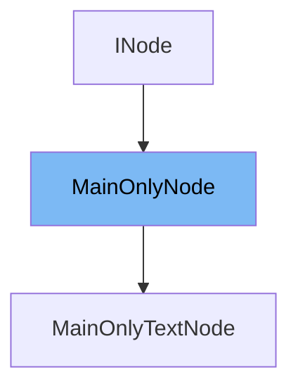

This document will cover the following aspects of the MainOnlyNode class:

1. What is MainOnlyNode
2. Variables and functions of MainOnlyNode
3. Usage example of MainOnlyNode



# What is MainOnlyNode

MainOnlyNode is a class that extends EventEmitter and implements INode. It is used for rendering user interfaces on web browsers running on embedded devices using WebGL. It provides a lightweight API for front-end application frameworks and includes a Visual Regression Test Runner for preventing bugs.

<SwmSnippet path="/src/render-drivers/main/MainOnlyNode.ts" line="53">

---

# Variables and functions

The constructor of MainOnlyNode initializes the class with properties such as id, coreNode, children, src, parent, texture, shader, and data. It also sets up event listeners for loaded, failed, freed, outOfBounds, inBounds, outOfViewport, and inViewport events.

```typescript
  readonly id;
  protected coreNode: CoreNode;

  // Prop stores
  protected _children: MainOnlyNode[] = [];
  protected _src = '';
  protected _parent: MainOnlyNode | null = null;
  protected _texture: TextureRef | null = null;
  protected _shader: ShaderRef | null = null;
  protected _data: CustomDataMap | undefined = {};

```

---

</SwmSnippet>

<SwmSnippet path="/src/render-drivers/main/MainOnlyNode.ts" line="129">

---

The `x` function is a getter and setter for the x-coordinate of the MainOnlyNode.

```typescript
  get x(): number {
    return this.coreNode.x;
  }

  set x(value: number) {
    this.coreNode.x = value;
  }
```

---

</SwmSnippet>

<SwmSnippet path="/src/render-drivers/main/MainOnlyNode.ts" line="137">

---

The `y` function is a getter and setter for the y-coordinate of the MainOnlyNode.

```typescript
  get y(): number {
    return this.coreNode.y;
  }

  set y(value: number) {
    this.coreNode.y = value;
  }
```

---

</SwmSnippet>

<SwmSnippet path="/src/render-drivers/main/MainOnlyNode.ts" line="145">

---

The `width` function is a getter and setter for the width of the MainOnlyNode. It also handles the creation of a new texture when the width changes.

```typescript
  get width(): number {
    return this.coreNode.width;
  }

  set width(value: number) {
    if (value !== this.coreNode.width && this.coreNode.rtt) {
      this.texture = this.rendererMain.createTexture(
        'RenderTexture',
        {
          width: this.width,
          height: this.height,
        },
        { preload: true, flipY: true },
      );
    }
    this.coreNode.width = value;
  }
```

---

</SwmSnippet>

<SwmSnippet path="/src/render-drivers/main/MainOnlyNode.ts" line="163">

---

The `height` function is a getter and setter for the height of the MainOnlyNode. It also handles the creation of a new texture when the height changes.

```typescript
  get height(): number {
    return this.coreNode.height;
  }

  set height(value: number) {
    if (value !== this.coreNode.height && this.coreNode.rtt) {
      this.texture = this.rendererMain.createTexture(
        'RenderTexture',
        {
          width: this.width,
          height: this.height,
        },
        { preload: true, flipY: true },
      );
    }
    this.coreNode.height = value;
  }
```

---

</SwmSnippet>

<SwmSnippet path="/src/render-drivers/main/MainOnlyNode.ts" line="181">

---

The `alpha` function is a getter and setter for the alpha value of the MainOnlyNode.

```typescript
  get alpha(): number {
    return this.coreNode.alpha;
  }

  set alpha(value: number) {
    this.coreNode.alpha = value;
  }
```

---

</SwmSnippet>

<SwmSnippet path="/src/render-drivers/main/MainOnlyNode.ts" line="189">

---

The `autosize` function is a getter and setter for the autosize property of the MainOnlyNode.

```typescript
  get autosize(): boolean {
    return this.coreNode.autosize;
  }

  set autosize(value: boolean) {
    this.coreNode.autosize = value;
  }
```

---

</SwmSnippet>

<SwmSnippet path="/src/render-drivers/main/MainOnlyNode.ts" line="197">

---

The `clipping` function is a getter and setter for the clipping property of the MainOnlyNode.

```typescript
  get clipping(): boolean {
    return this.coreNode.clipping;
  }

  set clipping(value: boolean) {
    this.coreNode.clipping = value;
  }
```

---

</SwmSnippet>

<SwmSnippet path="/src/render-drivers/main/MainOnlyNode.ts" line="205">

---

The `color` function is a getter and setter for the color property of the MainOnlyNode.

```typescript
  get color(): number {
    return this.coreNode.color;
  }

  set color(value: number) {
    this.coreNode.color = value;
  }
```

---

</SwmSnippet>

<SwmSnippet path="/src/render-drivers/main/MainOnlyNode.ts" line="213">

---

The `colorTop` function is a getter and setter for the colorTop property of the MainOnlyNode.

```typescript
  get colorTop(): number {
    return this.coreNode.colorTop;
  }

  set colorTop(value: number) {
    this.coreNode.colorTop = value;
  }
```

---

</SwmSnippet>

<SwmSnippet path="/src/render-drivers/main/MainOnlyNode.ts" line="221">

---

The `colorBottom` function is a getter and setter for the colorBottom property of the MainOnlyNode.

```typescript
  get colorBottom(): number {
    return this.coreNode.colorBottom;
  }

  set colorBottom(value: number) {
    this.coreNode.colorBottom = value;
  }
```

---

</SwmSnippet>

<SwmSnippet path="/src/render-drivers/main/MainOnlyNode.ts" line="229">

---

The `colorLeft` function is a getter and setter for the colorLeft property of the MainOnlyNode.

```typescript
  get colorLeft(): number {
    return this.coreNode.colorLeft;
  }

  set colorLeft(value: number) {
    this.coreNode.colorLeft = value;
  }
```

---

</SwmSnippet>

<SwmSnippet path="/src/render-drivers/main/MainOnlyNode.ts" line="237">

---

The `colorRight` function is a getter and setter for the colorRight property of the MainOnlyNode.

```typescript
  get colorRight(): number {
    return this.coreNode.colorRight;
  }

  set colorRight(value: number) {
    this.coreNode.colorRight = value;
  }
```

---

</SwmSnippet>

<SwmSnippet path="/src/render-drivers/main/MainOnlyNode.ts" line="245">

---

The `colorTl` function is a getter and setter for the colorTl property of the MainOnlyNode.

```typescript
  get colorTl(): number {
    return this.coreNode.colorTl;
  }

  set colorTl(value: number) {
    this.coreNode.colorTl = value;
  }
```

---

</SwmSnippet>

<SwmSnippet path="/src/render-drivers/main/MainOnlyNode.ts" line="253">

---

The `colorTr` function is a getter and setter for the colorTr property of the MainOnlyNode.

```typescript
  get colorTr(): number {
    return this.coreNode.colorTr;
  }

  set colorTr(value: number) {
    this.coreNode.colorTr = value;
  }
```

---

</SwmSnippet>

<SwmSnippet path="/src/render-drivers/main/MainOnlyNode.ts" line="261">

---

The `colorBl` function is a getter and setter for the colorBl property of the MainOnlyNode.

```typescript
  get colorBl(): number {
    return this.coreNode.colorBl;
  }

  set colorBl(value: number) {
    this.coreNode.colorBl = value;
  }
```

---

</SwmSnippet>

<SwmSnippet path="/src/render-drivers/main/MainOnlyNode.ts" line="269">

---

The `colorBr` function is a getter and setter for the colorBr property of the MainOnlyNode.

```typescript
  get colorBr(): number {
    return this.coreNode.colorBr;
  }

  set colorBr(value: number) {
    this.coreNode.colorBr = value;
  }
```

---

</SwmSnippet>

<SwmSnippet path="/src/render-drivers/main/MainOnlyNode.ts" line="277">

---

The `scale` function is a getter and setter for the scale property of the MainOnlyNode. It sets both scaleX and scaleY to the same value.

```typescript
  get scale(): number | null {
    if (this.scaleX !== this.scaleY) {
      return null;
    }
    return this.coreNode.scaleX;
  }

  set scale(value: number | null) {
    // We ignore `null` when it's set.
    if (value === null) {
      return;
    }
    this.coreNode.scaleX = value;
    this.coreNode.scaleY = value;
  }
```

---

</SwmSnippet>

<SwmSnippet path="/src/render-drivers/main/MainOnlyNode.ts" line="293">

---

The `scaleX` function is a getter and setter for the scaleX property of the MainOnlyNode.

```typescript
  get scaleX(): number {
    return this.coreNode.scaleX;
  }

  set scaleX(value: number) {
    this.coreNode.scaleX = value;
  }
```

---

</SwmSnippet>

<SwmSnippet path="/src/render-drivers/main/MainOnlyNode.ts" line="301">

---

The `scaleY` function is a getter and setter for the scaleY property of the MainOnlyNode.

```typescript
  get scaleY(): number {
    return this.coreNode.scaleY;
  }

  set scaleY(value: number) {
    this.coreNode.scaleY = value;
  }
```

---

</SwmSnippet>

<SwmSnippet path="/src/render-drivers/main/MainOnlyNode.ts" line="309">

---

The `mount` function is a getter and setter for the mount property of the MainOnlyNode.

```typescript
  get mount(): number {
    return this.coreNode.mount;
  }

  set mount(value: number) {
    this.coreNode.mount = value;
  }
```

---

</SwmSnippet>

<SwmSnippet path="/src/render-drivers/main/MainOnlyNode.ts" line="317">

---

The `mountX` function is a getter and setter for the mountX property of the MainOnlyNode.

```typescript
  get mountX(): number {
    return this.coreNode.mountX;
  }

  set mountX(value: number) {
    this.coreNode.mountX = value;
  }
```

---

</SwmSnippet>

<SwmSnippet path="/src/render-drivers/main/MainOnlyNode.ts" line="325">

---

The `mountY` function is a getter and setter for the mountY property of the MainOnlyNode.

```typescript
  get mountY(): number {
    return this.coreNode.mountY;
  }

  set mountY(value: number) {
    this.coreNode.mountY = value;
  }
```

---

</SwmSnippet>

<SwmSnippet path="/src/render-drivers/main/MainOnlyNode.ts" line="333">

---

The `pivot` function is a getter and setter for the pivot property of the MainOnlyNode.

```typescript
  get pivot(): number {
    return this.coreNode.pivot;
  }

  set pivot(value: number) {
    this.coreNode.pivot = value;
  }
```

---

</SwmSnippet>

<SwmSnippet path="/src/render-drivers/main/MainOnlyNode.ts" line="341">

---

The `pivotX` function is a getter and setter for the pivotX property of the MainOnlyNode.

```typescript
  get pivotX(): number {
    return this.coreNode.pivotX;
  }

  set pivotX(value: number) {
    this.coreNode.pivotX = value;
  }
```

---

</SwmSnippet>

<SwmSnippet path="/src/render-drivers/main/MainOnlyNode.ts" line="349">

---

The `pivotY` function is a getter and setter for the pivotY property of the MainOnlyNode.

```typescript
  get pivotY(): number {
    return this.coreNode.pivotY;
  }

  set pivotY(value: number) {
    this.coreNode.pivotY = value;
  }
```

---

</SwmSnippet>

<SwmSnippet path="/src/render-drivers/main/MainOnlyNode.ts" line="357">

---

The `rotation` function is a getter and setter for the rotation property of the MainOnlyNode.

```typescript
  get rotation(): number {
    return this.coreNode.rotation;
  }

  set rotation(value: number) {
    this.coreNode.rotation = value;
  }
```

---

</SwmSnippet>

<SwmSnippet path="/src/render-drivers/main/MainOnlyNode.ts" line="365">

---

The `parent` function is a getter and setter for the parent property of the MainOnlyNode. It also handles adding and removing the node from the parent's children array.

```typescript
  get parent(): MainOnlyNode | null {
    return this._parent;
  }

  set parent(newParent: MainOnlyNode | null) {
    const oldParent = this._parent;
    this._parent = newParent;
    this.coreNode.parent = newParent?.coreNode ?? null;
    if (oldParent) {
      const index = oldParent.children.indexOf(this);
      assertTruthy(
        index !== -1,
        "MainOnlyNode.parent: Node not found in old parent's children!",
      );
      oldParent.children.splice(index, 1);
    }
    if (newParent) {
      newParent.children.push(this);
    }
  }
```

---

</SwmSnippet>

<SwmSnippet path="/src/render-drivers/main/MainOnlyNode.ts" line="386">

---

The `children` function is a getter for the children array of the MainOnlyNode.

```typescript
  get children(): MainOnlyNode[] {
    return this._children;
  }
```

---

</SwmSnippet>

&nbsp;

*This is an auto-generated document by Swimm AI 🌊 and has not yet been verified by a human*

<SwmMeta version="3.0.0" repo-id="Z2l0aHViJTNBJTNBcmVuZGVyZXIlM0ElM0FTd2ltbS1EZW1v" repo-name="renderer" doc-type="class"><sup>Powered by [Swimm](/)</sup></SwmMeta>
