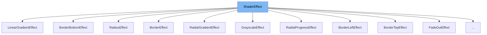

This document will cover the `ShaderEffect` class. We'll cover:

1. What is `ShaderEffect`
2. Variables and functions in `ShaderEffect`
3. Usage example of `ShaderEffect`



# What is ShaderEffect

`ShaderEffect` is an abstract class in the renderer's WebGL rendering pipeline. It's used to apply various visual effects to the rendered scene by manipulating pixel data. This is achieved through the use of shaders, small programs that run on the GPU.

<SwmSnippet path="/src/core/renderers/webgl/shaders/effects/ShaderEffect.ts" line="37">

---

# Variables and functions

The `ShaderEffect` class has several instance variables. `priority` is a readonly variable with a default value of 1. `name` is a readonly string variable with an empty default value. `ref` and `target` are string variables. `passParameters` and `declaredUniforms` are string variables with empty default values. `uniformInfo` is an object with keys as string and values as `UniformInfo`.

```typescript
export abstract class ShaderEffect {
  readonly priority = 1;
  readonly name: string = '';

  ref: string;
  target: string;

  passParameters = '';
  declaredUniforms = '';
  uniformInfo: Record<string, UniformInfo> = {};
```

---

</SwmSnippet>

<SwmSnippet path="/src/core/renderers/webgl/shaders/effects/ShaderEffect.ts" line="56">

---

The `getEffectKey` function is a static method that takes `props` as an argument and returns a string. In the `ShaderEffect` class, it returns an empty string by default.

```typescript
  static getEffectKey(props: Record<string, unknown>): string {
    return '';
  }
```

---

</SwmSnippet>

<SwmSnippet path="/src/core/renderers/webgl/shaders/effects/ShaderEffect.ts" line="60">

---

The `getMethodParameters` function is a static method that takes `uniforms` and `props` as arguments and returns a string. It iterates over the `uniforms` and constructs a string based on the `uniforms` type and size.

```typescript
  static getMethodParameters(
    uniforms: ShaderEffectUniforms,
    props: Record<string, unknown>,
  ): string {
    const res: string[] = [];
    for (const u in uniforms) {
      const uni = uniforms[u]!;
      let define = '';
      if (uni.size) {
        define = `[${uni.size(props)}]`;
      }
      res.push(`${uni.type} ${u}${define}`);
    }
    return res.join(',');
  }
```

---

</SwmSnippet>

<SwmSnippet path="/src/core/renderers/webgl/shaders/effects/ShaderEffect.ts" line="105">

---

The `resolveDefaults` function is a static method that takes `props` as an argument and returns an object. In the `ShaderEffect` class, it returns an empty object by default.

```typescript
  static resolveDefaults(
    props: Record<string, unknown>,
  ): Record<string, unknown> {
    return {};
  }
```

---

</SwmSnippet>

<SwmSnippet path="/src/core/renderers/webgl/shaders/effects/ShaderEffect.ts" line="111">

---

The `makeEffectKey` function is a static method that takes `props` as an argument and returns a string or false. In the `ShaderEffect` class, it returns false by default.

```typescript
  static makeEffectKey(props: Record<string, unknown>): string | false {
    return false;
  }
```

---

</SwmSnippet>

# Usage example

`ShaderEffect` is an abstract class and is not used directly. Instead, it is extended by other classes to create specific shader effects. For example, `BorderRightEffect` extends `ShaderEffect` to create a border effect on the right side of an element.

&nbsp;

*This is an auto-generated document by Swimm AI 🌊 and has not yet been verified by a human*

<SwmMeta version="3.0.0" repo-id="Z2l0aHViJTNBJTNBcmVuZGVyZXIlM0ElM0FTd2ltbS1EZW1v" repo-name="renderer" doc-type="class"><sup>Powered by [Swimm](/)</sup></SwmMeta>
