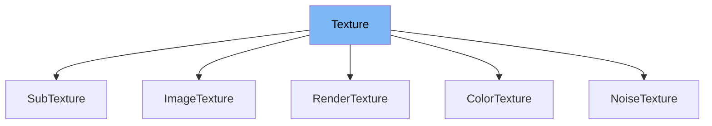

This document will cover the following aspects of the `Texture` class in the Renderer project:

1. What is `Texture`
2. Variables and functions of `Texture`
3. Usage example of `Texture`



# What is Texture

`Texture` is an abstract class that represents a source of texture data for a `CoreContextTexture`. Texture sources are used to populate a `CoreContextTexture` when that texture is loaded. The texture data is retrieved by the `CoreContextTexture` via the `getTextureData` method. It's the responsibility of the concrete `Texture` subclass to implement this method appropriately.

<SwmSnippet path="/src/core/textures/Texture.ts" line="140">

---

# Variables and functions

The `Texture` class has several properties. `dimensions` is a readonly property that represents the dimensions of the texture. `error` is a readonly property that represents any error that occurred. `state` is a readonly property that represents the current state of the texture. `renderableOwners` is a set that contains all the owners of the texture.

```typescript
  readonly dimensions: Readonly<Dimensions> | null = null;

  readonly error: Error | null = null;

  readonly state: TextureState = 'freed';
```

---

</SwmSnippet>

<SwmSnippet path="/src/core/textures/Texture.ts" line="166">

---

The `setRenderableOwner` function is used to add or remove an owner to/from the Texture based on its renderability. Any object can own a texture, be it a `CoreNode` or even the state object from a Text Renderer.

```typescript
  setRenderableOwner(owner: unknown, renderable: boolean): void {
    if (renderable) {
      this.renderableOwners.add(owner);
    } else {
      this.renderableOwners.delete(owner);
    }
  }
```

---

</SwmSnippet>

<SwmSnippet path="/src/core/textures/Texture.ts" line="177">

---

The `renderable` function returns true if the texture is assigned to any Nodes that are renderable.

```typescript
  get renderable(): boolean {
    return this.renderableOwners.size > 0;
  }
```

---

</SwmSnippet>

<SwmSnippet path="/src/core/textures/Texture.ts" line="191">

---

The `setState` function is used to set the state of the texture. It is intended for internal-use only but declared public so that it can be set by its associated `CoreContextTexture`.

```typescript
  setState<State extends TextureState>(
    state: State,
    ...args: ParametersSkipTarget<TextureStateEventMap[State]>
  ): void {
    if (this.state !== state) {
      // eslint-disable-next-line @typescript-eslint/no-unnecessary-type-assertion
      (this.state as TextureState) = state;
      if (state === 'loaded') {
        const loadedArgs = args as ParametersSkipTarget<
          TextureStateEventMap['loaded']
        >;
        (this.dimensions as Dimensions) = loadedArgs[0];
      } else if (state === 'failed') {
        const failedArgs = args as ParametersSkipTarget<
          TextureStateEventMap['failed']
        >;
        (this.error as Error) = failedArgs[0];
      }
      this.emit(state, ...args);
    }
  }
```

---

</SwmSnippet>

<SwmSnippet path="/src/core/textures/Texture.ts" line="223">

---

The `getTextureData` function is an abstract method that should be implemented by the concrete `Texture` subclass. It is used to get the texture data for this texture.

```typescript
  abstract getTextureData(): Promise<TextureData>;
```

---

</SwmSnippet>

<SwmSnippet path="/src/core/textures/Texture.ts" line="239">

---

The `makeCacheKey` function is a static method that should be implemented by the concrete `Texture` subclass. It is used to make a cache key for this texture.

```typescript
  // eslint-disable-next-line @typescript-eslint/no-unused-vars
  static makeCacheKey(props: unknown): string | false {
    return false;
  }
```

---

</SwmSnippet>

<SwmSnippet path="/src/core/textures/Texture.ts" line="255">

---

The `resolveDefaults` function is a static method that should be implemented by the concrete `Texture` subclass. It is used to resolve the default values for the texture's properties.

```typescript
  static resolveDefaults(
    // eslint-disable-next-line @typescript-eslint/no-unused-vars
    props: unknown,
  ): Record<string, unknown> {
    return {};
  }
```

---

</SwmSnippet>

# Usage example

`Texture` is an abstract class and cannot be used directly. However, it can be extended by other classes to create concrete texture classes. For example, the `ColorTexture` class in `src/core/textures/ColorTexture.ts` extends `Texture` and provides an implementation for the `getTextureData` method.

&nbsp;

*This is an auto-generated document by Swimm AI 🌊 and has not yet been verified by a human*

<SwmMeta version="3.0.0" repo-id="Z2l0aHViJTNBJTNBcmVuZGVyZXIlM0ElM0FTd2ltbS1EZW1v" repo-name="renderer" doc-type="class"><sup>Powered by [Swimm](/)</sup></SwmMeta>
