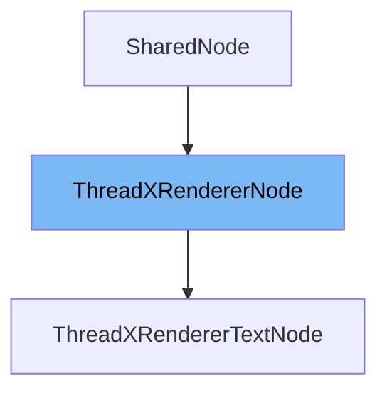

This document will cover the following aspects of the ThreadXRendererNode class:

1. What is ThreadXRendererNode
2. Variables and functions of ThreadXRendererNode
3. Usage example of ThreadXRendererNode



# What is ThreadXRendererNode

ThreadXRendererNode is a class that extends the SharedNode class. It is used for rendering performant user interfaces on web browsers running on embedded devices using WebGL. It provides a lightweight API for front-end application frameworks and includes a Visual Regression Test Runner for preventing bugs.

<SwmSnippet path="/src/render-drivers/threadx/worker/ThreadXRendererNode.ts" line="40">

---

# Variables and functions

ThreadXRendererNode has several variables. `coreNode` is of type CoreNode and is used to store the core node of the renderer. `_parent` is a reference to the parent ThreadXRendererNode or null if there is no parent. `_children` is an array of ThreadXRendererNode objects representing the children of the current node. `texture` is of type Texture or null, and is used to store the texture of the node.

```typescript
  protected coreNode: CoreNode;
  protected _parent: ThreadXRendererNode | null = null;
  protected _children: ThreadXRendererNode[] = [];
  texture: Texture | null = null;
```

---

</SwmSnippet>

<SwmSnippet path="/src/render-drivers/threadx/worker/ThreadXRendererNode.ts" line="161">

---

The function `onPropertyChange` is used to handle changes to properties. It checks if the changed property is 'parentId', and if so, it updates the parent of the node. Otherwise, it updates the corresponding property on the coreNode.

```typescript
  override onPropertyChange<Key extends keyof this['z$__type__Props']>(
    propName: Key,
    newValue: this['z$__type__Props'][Key],
    oldValue: this['z$__type__Props'][Key] | undefined,
  ): void {
    if (propName === 'parentId') {
      const parent = ThreadX.instance.getSharedObjectById(newValue as number);
      assertTruthy(parent instanceof ThreadXRendererNode || parent === null);
      this.parent = parent;
      return;
    } else {
      // @ts-expect-error Ignore readonly assignment errors
      this.coreNode[propName as keyof CoreNode] =
        newValue as CoreNode[keyof CoreNode];
    }
  }
```

---

</SwmSnippet>

<SwmSnippet path="/src/render-drivers/threadx/worker/ThreadXRendererNode.ts" line="179">

---

The function `parent` is a getter function that returns the parent of the current node.

```typescript
  get parent(): ThreadXRendererNode | null {
    return this._parent;
  }
```

---

</SwmSnippet>

<SwmSnippet path="/src/render-drivers/threadx/worker/ThreadXRendererNode.ts" line="183">

---

The function `parent` is also a setter function that sets the parent of the current node. It also updates the children array of the old and new parent nodes accordingly.

```typescript
  set parent(newParent: ThreadXRendererNode | null) {
    const oldParent = this._parent;
    this._parent = newParent;
    this.coreNode.parent = newParent?.coreNode ?? null;
    this.parentId = newParent?.id ?? 0;
    if (oldParent) {
      const index = oldParent.children.indexOf(this);
      assertTruthy(
        index !== -1,
        "ThreadXRendererNode.parent: Node not found in old parent's children!",
      );
      oldParent.children.splice(index, 1);
    }
    if (newParent) {
      newParent.children.push(this);
    }
  }
```

---

</SwmSnippet>

<SwmSnippet path="/src/render-drivers/threadx/worker/ThreadXRendererNode.ts" line="201">

---

The function `children` is a getter function that returns the children of the current node.

```typescript
  get children(): ThreadXRendererNode[] {
    return this._children;
  }
```

---

</SwmSnippet>

<SwmSnippet path="/src/render-drivers/threadx/worker/ThreadXRendererNode.ts" line="206">

---

The function `createCoreNode` is used to create a new CoreNode instance. It takes in a stage and a sharedNodeStruct as parameters, and returns a new CoreNode instance.

```typescript
  private createCoreNode(stage: Stage, sharedNodeStruct: NodeStruct) {
    const parent = ThreadX.instance.getSharedObjectById(
      sharedNodeStruct.parentId,
    );
    assertTruthy(parent instanceof ThreadXRendererNode || parent === null);
    const node = new CoreNode(stage, {
      id: sharedNodeStruct.id,
      x: sharedNodeStruct.x,
      y: sharedNodeStruct.y,
      width: sharedNodeStruct.width,
      height: sharedNodeStruct.height,
      alpha: sharedNodeStruct.alpha,
      autosize: sharedNodeStruct.autosize,
      clipping: sharedNodeStruct.clipping,
      color: sharedNodeStruct.color,
      colorTop: sharedNodeStruct.colorTop,
      colorBottom: sharedNodeStruct.colorBottom,
      colorLeft: sharedNodeStruct.colorLeft,
      colorRight: sharedNodeStruct.colorRight,
      colorTl: sharedNodeStruct.colorTl,
      colorTr: sharedNodeStruct.colorTr,
```

---

</SwmSnippet>

<SwmSnippet path="/src/render-drivers/threadx/worker/ThreadXRendererNode.ts" line="47">

---

The `constructor` function is used to create a new instance of the ThreadXRendererNode class. It takes in a stage, a sharedNodeStruct, an optional coreNode, and an optional extendedCurProps. It sets up the coreNode, parent, and event listeners.

```typescript
  constructor(
    private stage: Stage,
    sharedNodeStruct: NodeStruct,
    coreNode?: CoreNode,
    extendedCurProps?: Record<string, unknown>,
  ) {
    super(sharedNodeStruct, extendedCurProps);
    // This Proxy makes sure properties on the coreNode that an animation
    // changes are also updated on the shared node.
    // TODO: Improve this pattern because its ugly!!!
    this.coreNode = new Proxy(
      coreNode || this.createCoreNode(stage, sharedNodeStruct),
      {
        set: (target, prop, value) => {
          // Only set the numeric properties on the shared node.
          if (prop !== 'parent' && prop !== 'texture' && prop !== 'shader') {
            Reflect.set(this, prop, value);
          }
          return Reflect.set(target, prop, value);
        },
      },
```

---

</SwmSnippet>

<SwmSnippet path="/src/render-drivers/threadx/worker/ThreadXRendererTextNode.ts" line="30">

---

# Usage example

ThreadXRendererNode is used in the ThreadXRendererTextNode class. ThreadXRendererTextNode extends ThreadXRendererNode and overrides some of its properties and methods.

```typescript
export class ThreadXRendererTextNode extends ThreadXRendererNode {
  declare coreNode: CoreTextNode;
  declare z$__type__Props: TextNodeStructWritableProps &
    ThreadXRendererNode['z$__type__Props'];
```

---

</SwmSnippet>

&nbsp;

*This is an auto-generated document by Swimm AI 🌊 and has not yet been verified by a human*

<SwmMeta version="3.0.0" repo-id="Z2l0aHViJTNBJTNBcmVuZGVyZXIlM0ElM0FTd2ltbS1EZW1v" repo-name="renderer" doc-type="class"><sup>Powered by [Swimm](/)</sup></SwmMeta>
