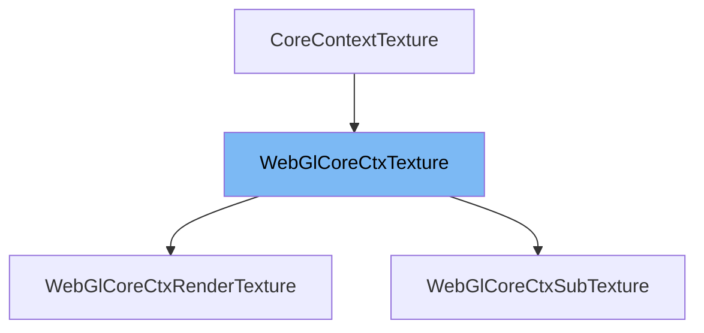

This document will cover the following aspects of the `WebGlCoreCtxTexture` class:

1. What is `WebGlCoreCtxTexture`.
2. Explanation of the variables and functions in `WebGlCoreCtxTexture`.
3. An example of how `WebGlCoreCtxTexture` is used in `WebGlCoreCtxRenderTexture`.



# What is WebGlCoreCtxTexture

`WebGlCoreCtxTexture` is a class that wraps around a WebGLTexture. It handles the loading of texture data from a Texture source, uploads it to the GPU, and also manages the freeing of the uploaded texture. When the `ctxTexture` property is accessed, the texture will be loaded if it hasn't been already. `ctxTexture` will always return a valid WebGLTexture and trigger the loading/uploading of the texture's data if it hasn't been loaded yet.

<SwmSnippet path="/src/core/renderers/webgl/WebGlCoreCtxTexture.ts" line="43">

---

# Variables and functions

`_nativeCtxTexture` is a WebGLTexture object that is initially set to null. `_state` is a string that represents the current state of the texture. It can be 'freed', 'loading', 'loaded', or 'failed'. `_w` and `_h` are numbers that represent the width and height of the texture respectively.

```typescript
  protected _nativeCtxTexture: WebGLTexture | null = null;
  private _state: 'freed' | 'loading' | 'loaded' | 'failed' = 'freed';
  private _w = 0;
  private _h = 0;
```

---

</SwmSnippet>

<SwmSnippet path="/src/core/renderers/webgl/WebGlCoreCtxTexture.ts" line="56">

---

The `ctxTexture` function is a getter that returns a WebGLTexture. If the state of the texture is 'freed', it triggers the load function to load the texture. It asserts that `_nativeCtxTexture` is truthy and then returns `_nativeCtxTexture`.

```typescript
  get ctxTexture(): WebGLTexture {
    if (this._state === 'freed') {
      this.load();
    }
    assertTruthy(this._nativeCtxTexture);
    return this._nativeCtxTexture;
  }
```

---

</SwmSnippet>

<SwmSnippet path="/src/core/renderers/webgl/WebGlCoreCtxTexture.ts" line="64">

---

The `renderable` function is a getter that returns a boolean indicating whether the texture source is renderable.

```typescript
  get renderable(): boolean {
    return this.textureSource.renderable;
  }
```

---

</SwmSnippet>

<SwmSnippet path="/src/core/renderers/webgl/WebGlCoreCtxTexture.ts" line="68">

---

The `w` function is a getter that returns the width of the texture.

```typescript
  get w() {
    return this._w;
  }
```

---

</SwmSnippet>

<SwmSnippet path="/src/core/renderers/webgl/WebGlCoreCtxTexture.ts" line="72">

---

The `h` function is a getter that returns the height of the texture.

```typescript
  get h() {
    return this._h;
  }
```

---

</SwmSnippet>

<SwmSnippet path="/src/core/renderers/webgl/WebGlCoreCtxTexture.ts" line="85">

---

The `load` function loads the texture data from the Texture source and uploads it to the GPU. If the texture is already loading or loaded, it doesn't load it again. It sets the state to 'loading', creates a native context texture, and then calls `onLoadRequest`.

```typescript
  load() {
    // If the texture is already loading or loaded, don't load it again.
    if (this._state === 'loading' || this._state === 'loaded') {
      return;
    }
    this._state = 'loading';
    this.textureSource.setState('loading');
    this._nativeCtxTexture = this.createNativeCtxTexture();
    this.onLoadRequest()
      .then(({ width, height }) => {
        // If the texture has been freed while loading, return early.
        if (this._state === 'freed') {
          return;
        }
        this._state = 'loaded';
        this._w = width;
        this._h = height;
        // Update the texture source's width and height so that it can be used
        // for rendering.
        this.textureSource.setState('loaded', { width, height });
      })
```

---

</SwmSnippet>

<SwmSnippet path="/src/core/renderers/webgl/WebGlCoreCtxTexture.ts" line="120">

---

The `onLoadRequest` function is an asynchronous function that is called when the texture data needs to be loaded and uploaded to a texture. It sets the texture to a 1x1 transparent texture, gets the texture data, and then uploads the data to the GPU.

```typescript
  async onLoadRequest(): Promise<Dimensions> {
    const { glw, memManager } = this;

    // Set to a 1x1 transparent texture
    glw.texImage2D(0, glw.RGBA, 1, 1, 0, glw.RGBA, glw.UNSIGNED_BYTE, null);
    memManager.setTextureMemUse(this, TRANSPARENT_TEXTURE_DATA.byteLength);

    const textureData = await this.textureSource?.getTextureData();
    // If the texture has been freed while loading, return early.
    if (!this._nativeCtxTexture) {
      assertTruthy(this._state === 'freed');
      return { width: 0, height: 0 };
    }
    let width = 0;
    let height = 0;

    assertTruthy(this._nativeCtxTexture);
    glw.activeTexture(0);
    // If textureData is null, the texture is empty (0, 0) and we don't need to
    // upload any data to the GPU.
    if (
```

---

</SwmSnippet>

<SwmSnippet path="/src/core/renderers/webgl/WebGlCoreCtxTexture.ts" line="219">

---

The `free` function frees the WebGLTexture from the GPU. If the state of the texture is 'freed', it doesn't do anything. Otherwise, it sets the state to 'freed', sets the texture source state to 'freed', resets the width and height to 0, and deletes the texture from the GPU.

```typescript
  free() {
    if (this._state === 'freed') {
      return;
    }
    this._state = 'freed';
    this.textureSource.setState('freed');
    this._w = 0;
    this._h = 0;
    if (!this._nativeCtxTexture) {
      return;
    }
    const { glw, memManager } = this;

    glw.deleteTexture(this._nativeCtxTexture);
    memManager.setTextureMemUse(this, 0);
    this._nativeCtxTexture = null;
  }
```

---

</SwmSnippet>

<SwmSnippet path="/src/core/renderers/webgl/WebGlCoreCtxTexture.ts" line="247">

---

The `createNativeCtxTexture` function creates a native context texture. It creates a WebGLTexture, binds it to the GL context state, sets the texture filtering and wrapping method, and then returns the native texture.

```typescript
  protected createNativeCtxTexture() {
    const { glw } = this;
    const nativeTexture = glw.createTexture();
    if (!nativeTexture) {
      throw new Error('Could not create WebGL Texture');
    }

    // On initial load request, create a 1x1 transparent texture to use until
    // the texture data is finally loaded.
    glw.activeTexture(0);
    glw.bindTexture(nativeTexture);

    // linear texture filtering
    glw.texParameteri(glw.TEXTURE_MAG_FILTER, glw.LINEAR);
    glw.texParameteri(glw.TEXTURE_MIN_FILTER, glw.LINEAR);

    // texture wrapping method
    glw.texParameteri(glw.TEXTURE_WRAP_S, glw.CLAMP_TO_EDGE);
    glw.texParameteri(glw.TEXTURE_WRAP_T, glw.CLAMP_TO_EDGE);
    return nativeTexture;
  }
```

---

</SwmSnippet>

<SwmSnippet path="/src/core/renderers/webgl/WebGlCoreCtxRenderTexture.ts" line="27">

---

# Usage example

`WebGlCoreCtxTexture` is used in `WebGlCoreCtxRenderTexture` class where it is extended to create a new class.

```typescript
export class WebGlCoreCtxRenderTexture extends WebGlCoreCtxTexture {
  declare textureSource: RenderTexture;
```

---

</SwmSnippet>

&nbsp;

*This is an auto-generated document by Swimm AI 🌊 and has not yet been verified by a human*

<SwmMeta version="3.0.0" repo-id="Z2l0aHViJTNBJTNBcmVuZGVyZXIlM0ElM0FTd2ltbS1EZW1v" repo-name="renderer" doc-type="class"><sup>Powered by [Swimm](/)</sup></SwmMeta>
