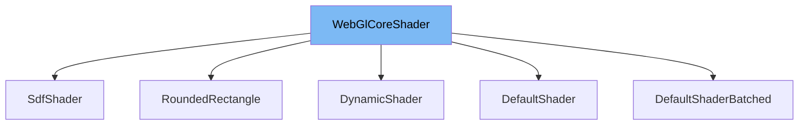

This document will cover the following aspects of the WebGlCoreShader class:

1. What is WebGlCoreShader
2. Variables and functions of WebGlCoreShader
3. Usage example of WebGlCoreShader



# What is WebGlCoreShader

WebGlCoreShader is an abstract class that extends the CoreShader class. It is used for rendering 2D scenes on web browsers running on embedded devices using WebGL. It provides a lightweight API for front-end application frameworks and includes a Visual Regression Test Runner for preventing bugs.

<SwmSnippet path="/src/core/renderers/webgl/WebGlCoreShader.ts" line="69">

---

# Variables and functions

These are the variables defined in the WebGlCoreShader class. They include `boundBufferCollection`, `buffersBound`, `program`, `vao`, `renderer`, `glw`, `attributeBuffers`, `attributeLocations`, `attributeNames`, `uniformLocations`, `uniformTypes`, and `supportsIndexedTextures`. These variables are used to store the state and configuration of the shader.

```typescript
  protected boundBufferCollection: BufferCollection | null = null;
  protected buffersBound = false;
  protected program: WebGLProgram;
  /**
   * Vertex Array Object
   *
   * @remarks
   * Used by WebGL2 Only
   */
  protected vao: WebGLVertexArrayObject | undefined;
  protected renderer: WebGlCoreRenderer;
  protected glw: WebGlContextWrapper;
  protected attributeBuffers: Record<string, WebGLBuffer>;
  protected attributeLocations: Record<string, number>;
  protected attributeNames: string[];
  protected uniformLocations: Record<string, WebGLUniformLocation>;
  protected uniformTypes: Record<string, keyof UniformMethodMap>;
  readonly supportsIndexedTextures: boolean;
```

---

</SwmSnippet>

<SwmSnippet path="/src/core/renderers/webgl/WebGlCoreShader.ts" line="204">

---

The `bindBufferAttribute` function is used to bind a buffer to a specific attribute location. It enables the vertex attribute array and specifies the data formats and locations of the vertex attributes in the vertex buffer object.

```typescript
  private bindBufferAttribute(
    location: number,
    buffer: WebGLBuffer,
    attribute: AttributeInfo,
  ) {
    const { glw } = this;
    glw.enableVertexAttribArray(location);

    glw.vertexAttribPointer(
      buffer,
      location,
      attribute.size,
      attribute.type,
      attribute.normalized,
      attribute.stride,
      attribute.offset,
    );
  }
```

---

</SwmSnippet>

<SwmSnippet path="/src/core/renderers/webgl/WebGlCoreShader.ts" line="223">

---

The `disableAttribute` function is used to disable a specific attribute location.

```typescript
  disableAttribute(location: number) {
    this.glw.disableVertexAttribArray(location);
  }
```

---

</SwmSnippet>

<SwmSnippet path="/src/core/renderers/webgl/WebGlCoreShader.ts" line="227">

---

The `disableAttributes` function is used to disable all attribute locations and set `boundBufferCollection` to null.

```typescript
  disableAttributes() {
    for (const loc in this.attributeLocations) {
      this.disableAttribute(this.attributeLocations[loc] as number);
    }
    this.boundBufferCollection = null;
  }
```

---

</SwmSnippet>

<SwmSnippet path="/src/core/renderers/webgl/WebGlCoreShader.ts" line="249">

---

The `canBatchShaderProps` function is used to determine if two sets of Shader props can be batched together to reduce the number of draw calls. By default, it returns false, meaning no batching is allowed.

```typescript
  canBatchShaderProps(
    propsA: Record<string, unknown>,
    propsB: Record<string, unknown>,
  ): boolean {
    return false;
  }
```

---

</SwmSnippet>

<SwmSnippet path="/src/core/renderers/webgl/WebGlCoreShader.ts" line="256">

---

The `bindRenderOp` function is used to bind a render operation and its properties. It binds the buffer collection, textures, and optional automatic uniforms if they are present in the props.

```typescript
  bindRenderOp(
    renderOp: WebGlCoreRenderOp,
    props: Record<string, unknown> | null,
  ) {
    this.bindBufferCollection(renderOp.buffers);
    if (renderOp.textures.length > 0) {
      this.bindTextures(renderOp.textures);
    }

    const { glw, parentHasRenderTexture, renderToTexture } = renderOp;

    // Skip if the parent and current operation both have render textures
    if (renderToTexture && parentHasRenderTexture) {
      return;
    }

    // Bind render texture framebuffer dimensions as resolution
    // if the parent has a render texture
    if (parentHasRenderTexture) {
      const { width, height } = renderOp.framebufferDimensions || {};
      // Force pixel ratio to 1.0 for render textures since they are always 1:1
```

---

</SwmSnippet>

<SwmSnippet path="/src/core/renderers/webgl/WebGlCoreShader.ts" line="314">

---

The `setUniform` function is used to set the uniform value for a specific name.

```typescript
  setUniform(name: string, ...value: any[]): void {
    // eslint-disable-next-line @typescript-eslint/no-non-null-assertion, @typescript-eslint/no-unsafe-argument
    this.glw.setUniform(
      this.uniformTypes[name]!,
      this.uniformLocations[name]!,
      ...(value as any),
    );
  }
```

---

</SwmSnippet>

<SwmSnippet path="/src/core/renderers/webgl/WebGlCoreShader.ts" line="323">

---

The `bindBufferCollection` function is used to bind a buffer collection to all attribute locations.

```typescript
  bindBufferCollection(buffer: BufferCollection) {
    if (this.boundBufferCollection === buffer) {
      return;
    }
    for (const attributeName in this.attributeLocations) {
      const resolvedBuffer = buffer.getBuffer(attributeName);
      const resolvedInfo = buffer.getAttributeInfo(attributeName);
      assertTruthy(resolvedBuffer, `Buffer for "${attributeName}" not found`);
      assertTruthy(resolvedInfo);
      this.bindBufferAttribute(
        this.attributeLocations[attributeName]!,
        resolvedBuffer,
        resolvedInfo,
      );
    }
    this.boundBufferCollection = buffer;
  }
```

---

</SwmSnippet>

<SwmSnippet path="/src/core/renderers/webgl/WebGlCoreShader.ts" line="341">

---

The `bindProps` function is an abstract function that should be implemented in child classes.

```typescript
  protected override bindProps(props: Record<string, unknown>) {
    // Implement in child class
  }
```

---

</SwmSnippet>

<SwmSnippet path="/src/core/renderers/webgl/WebGlCoreShader.ts" line="345">

---

The `bindTextures` function is used to bind textures. It has no default implementation.

```typescript
  bindTextures(textures: WebGlCoreCtxTexture[]) {
    // no defaults
  }
```

---

</SwmSnippet>

<SwmSnippet path="/src/core/renderers/webgl/WebGlCoreShader.ts" line="349">

---

The `attach` function is used to attach the shader program and bind the vertex array object if WebGL2 is used.

```typescript
  override attach(): void {
    this.glw.useProgram(this.program);
    this.glw.useProgram(this.program);
    if (this.glw.isWebGl2() && this.vao) {
      this.glw.bindVertexArray(this.vao);
    }
  }
```

---

</SwmSnippet>

<SwmSnippet path="/src/core/renderers/webgl/WebGlCoreShader.ts" line="357">

---

The `detach` function is used to disable all attribute locations.

```typescript
  override detach(): void {
    this.disableAttributes();
  }
```

---

</SwmSnippet>

# Usage example

The RoundedRectangle class in src/core/renderers/webgl/shaders/RoundedRectangle.ts is an example of a class that extends WebGlCoreShader. It sets the renderer and other options in the constructor of the superclass.

&nbsp;

*This is an auto-generated document by Swimm AI 🌊 and has not yet been verified by a human*

<SwmMeta version="3.0.0" repo-id="Z2l0aHViJTNBJTNBcmVuZGVyZXIlM0ElM0FTd2ltbS1EZW1v" repo-name="renderer" doc-type="class"><sup>Powered by [Swimm](/)</sup></SwmMeta>
