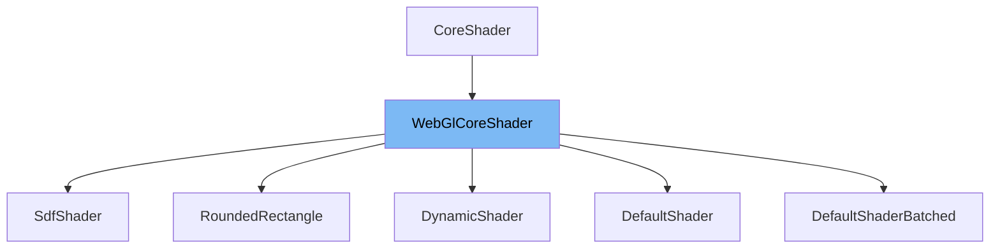

This document will cover the following aspects of the WebGlCoreShader class:

1. What is WebGlCoreShader
2. Variables and functions of WebGlCoreShader
3. Usage example of WebGlCoreShader



# What is WebGlCoreShader

WebGlCoreShader is an abstract class that extends the CoreShader class. It is used for rendering 2D scenes on web browsers running on embedded devices using WebGL. It provides a lightweight API for front-end application frameworks and includes a Visual Regression Test Runner for preventing bugs.

<SwmSnippet path="/src/core/renderers/webgl/WebGlCoreShader.ts" line="68">

---

# Variables and functions

The WebGlCoreShader class contains several variables and functions. The variables include `boundBufferCollection`, `buffersBound`, `program`, `vao`, `renderer`, `glw`, `attributeBuffers`, `attributeLocations`, `attributeNames`, `uniformLocations`, `uniformTypes`, and `supportsIndexedTextures`. The functions include `constructor`, `bindBufferAttribute`, `disableAttribute`, `disableAttributes`, `canBatchShaderProps`, `bindRenderOp`, `setUniform`, `bindBufferCollection`, `bindProps`, `bindTextures`, `attach`, and `detach`.

```typescript
export abstract class WebGlCoreShader extends CoreShader {
  protected boundBufferCollection: BufferCollection | null = null;
  protected buffersBound = false;
  protected program: WebGLProgram;
  /**
   * Vertex Array Object
   *
   * @remarks
   * Used by WebGL2 Only
   */
  protected vao: WebGLVertexArrayObject | undefined;
  protected renderer: WebGlCoreRenderer;
  protected glw: WebGlContextWrapper;
  protected attributeBuffers: Record<string, WebGLBuffer>;
  protected attributeLocations: Record<string, number>;
  protected attributeNames: string[];
  protected uniformLocations: Record<string, WebGLUniformLocation>;
  protected uniformTypes: Record<string, keyof UniformMethodMap>;
  readonly supportsIndexedTextures: boolean;

  constructor(options: ShaderOptions) {
```

---

</SwmSnippet>

<SwmSnippet path="/src/core/renderers/webgl/WebGlCoreShader.ts" line="204">

---

# Function: bindBufferAttribute

The `bindBufferAttribute` function is used to bind a buffer to a given attribute. It takes three parameters: `location`, `buffer`, and `attribute`. The function enables the vertex attribute array at the specified location, and then binds the buffer to the attribute using the `vertexAttribPointer` method.

```typescript
  private bindBufferAttribute(
    location: number,
    buffer: WebGLBuffer,
    attribute: AttributeInfo,
  ) {
    const { glw } = this;
    glw.enableVertexAttribArray(location);

    glw.vertexAttribPointer(
      buffer,
      location,
      attribute.size,
      attribute.type,
      attribute.normalized,
      attribute.stride,
      attribute.offset,
    );
  }
```

---

</SwmSnippet>

<SwmSnippet path="/src/core/renderers/webgl/WebGlCoreShader.ts" line="223">

---

# Function: disableAttribute

The `disableAttribute` function is used to disable the vertex attribute array at a given location. It takes one parameter: `location`.

```typescript
  disableAttribute(location: number) {
    this.glw.disableVertexAttribArray(location);
  }
```

---

</SwmSnippet>

<SwmSnippet path="/src/core/renderers/webgl/WebGlCoreShader.ts" line="227">

---

# Function: disableAttributes

The `disableAttributes` function is used to disable all the vertex attribute arrays that have been enabled. It does not take any parameters.

```typescript
  disableAttributes() {
    for (const loc in this.attributeLocations) {
      this.disableAttribute(this.attributeLocations[loc] as number);
    }
    this.boundBufferCollection = null;
  }
```

---

</SwmSnippet>

<SwmSnippet path="/src/core/renderers/webgl/WebGlCoreShader.ts" line="234">

---

# Function: canBatchShaderProps

The `canBatchShaderProps` function is used to determine if two sets of shader properties can be batched together to reduce the number of draw calls. It takes two parameters: `propsA` and `propsB`. By default, this function returns false, meaning no batching is allowed.

```typescript
  /**
   * Given two sets of Shader props destined for this Shader, determine if they can be batched together
   * to reduce the number of draw calls.
   *
   * @remarks
   * This is used by the {@link WebGlCoreRenderer} to determine if it can batch multiple consecutive draw
   * calls into a single draw call.
   *
   * By default, this returns false (meaning no batching is allowed), but can be
   * overridden by child classes to provide more efficient batching.
   *
   * @param propsA
   * @param propsB
   * @returns
   */
  canBatchShaderProps(
    propsA: Record<string, unknown>,
    propsB: Record<string, unknown>,
  ): boolean {
    return false;
  }
```

---

</SwmSnippet>

<SwmSnippet path="/src/core/renderers/webgl/WebGlCoreShader.ts" line="256">

---

# Function: bindRenderOp

The `bindRenderOp` function is used to bind a render operation and its properties. It takes two parameters: `renderOp` and `props`. The function binds the buffer collection and textures of the render operation, sets the uniform values, and binds the properties.

```typescript
  bindRenderOp(
    renderOp: WebGlCoreRenderOp,
    props: Record<string, unknown> | null,
  ) {
    this.bindBufferCollection(renderOp.buffers);
    if (renderOp.textures.length > 0) {
      this.bindTextures(renderOp.textures);
    }

    const { glw, parentHasRenderTexture, renderToTexture } = renderOp;

    // Skip if the parent and current operation both have render textures
    if (renderToTexture && parentHasRenderTexture) {
      return;
    }

    // Bind render texture framebuffer dimensions as resolution
    // if the parent has a render texture
    if (parentHasRenderTexture) {
      const { width, height } = renderOp.framebufferDimensions || {};
      // Force pixel ratio to 1.0 for render textures since they are always 1:1
```

---

</SwmSnippet>

<SwmSnippet path="/src/core/renderers/webgl/WebGlCoreShader.ts" line="314">

---

# Function: setUniform

The `setUniform` function is used to set the value of a uniform variable in the shader program. It takes a variable number of parameters: the first parameter is the name of the uniform variable, and the remaining parameters are the values to be set.

```typescript
  setUniform(name: string, ...value: any[]): void {
    // eslint-disable-next-line @typescript-eslint/no-non-null-assertion, @typescript-eslint/no-unsafe-argument
    this.glw.setUniform(
      this.uniformTypes[name]!,
      this.uniformLocations[name]!,
      ...(value as any),
    );
  }
```

---

</SwmSnippet>

<SwmSnippet path="/src/core/renderers/webgl/WebGlCoreShader.ts" line="323">

---

# Function: bindBufferCollection

The `bindBufferCollection` function is used to bind a buffer collection. It takes one parameter: `buffer`. The function binds each attribute in the buffer collection to its corresponding buffer attribute.

```typescript
  bindBufferCollection(buffer: BufferCollection) {
    if (this.boundBufferCollection === buffer) {
      return;
    }
    for (const attributeName in this.attributeLocations) {
      const resolvedBuffer = buffer.getBuffer(attributeName);
      const resolvedInfo = buffer.getAttributeInfo(attributeName);
      assertTruthy(resolvedBuffer, `Buffer for "${attributeName}" not found`);
      assertTruthy(resolvedInfo);
      this.bindBufferAttribute(
        this.attributeLocations[attributeName]!,
        resolvedBuffer,
        resolvedInfo,
      );
    }
    this.boundBufferCollection = buffer;
  }
```

---

</SwmSnippet>

<SwmSnippet path="/src/core/renderers/webgl/WebGlCoreShader.ts" line="341">

---

# Function: bindProps

The `bindProps` function is an abstract method that is meant to be implemented in child classes. It is used to bind properties.

```typescript
  protected override bindProps(props: Record<string, unknown>) {
    // Implement in child class
  }
```

---

</SwmSnippet>

<SwmSnippet path="/src/core/renderers/webgl/WebGlCoreShader.ts" line="345">

---

# Function: bindTextures

The `bindTextures` function is an abstract method that is meant to be implemented in child classes. It is used to bind textures.

```typescript
  bindTextures(textures: WebGlCoreCtxTexture[]) {
    // no defaults
  }
```

---

</SwmSnippet>

<SwmSnippet path="/src/core/renderers/webgl/WebGlCoreShader.ts" line="349">

---

# Function: attach

The `attach` function is used to attach the shader program and the vertex array object (if available). It does not take any parameters.

```typescript
  override attach(): void {
    this.glw.useProgram(this.program);
    this.glw.useProgram(this.program);
    if (this.glw.isWebGl2() && this.vao) {
      this.glw.bindVertexArray(this.vao);
    }
  }
```

---

</SwmSnippet>

<SwmSnippet path="/src/core/renderers/webgl/WebGlCoreShader.ts" line="357">

---

# Function: detach

The `detach` function is used to disable all the vertex attribute arrays that have been enabled. It does not take any parameters.

```typescript
  override detach(): void {
    this.disableAttributes();
  }
```

---

</SwmSnippet>

<SwmSnippet path="/src/core/renderers/webgl/shaders/RoundedRectangle.ts" line="44">

---

# Usage example

The RoundedRectangle class is an example of a class that extends the WebGlCoreShader class. It sets the renderer in the constructor.

```typescript
export class RoundedRectangle extends WebGlCoreShader {
  constructor(renderer: WebGlCoreRenderer) {
```

---

</SwmSnippet>

&nbsp;

*This is an auto-generated document by Swimm AI 🌊 and has not yet been verified by a human*

<SwmMeta version="3.0.0" repo-id="Z2l0aHViJTNBJTNBcmVuZGVyZXIlM0ElM0FTd2ltbS1EZW1v" repo-name="renderer" doc-type="class"><sup>Powered by [Swimm](/)</sup></SwmMeta>
